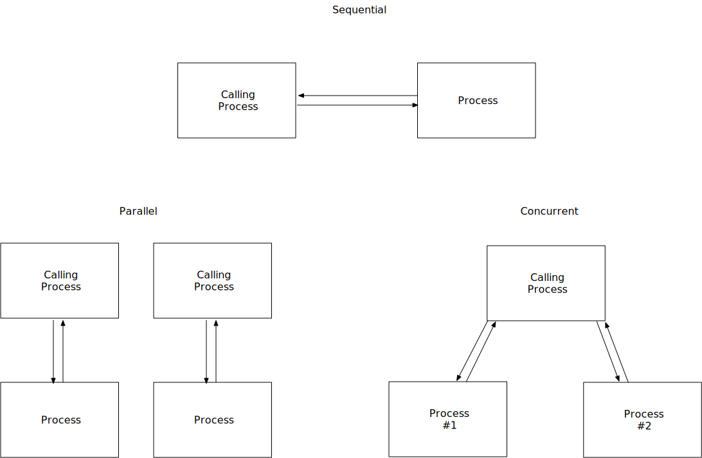
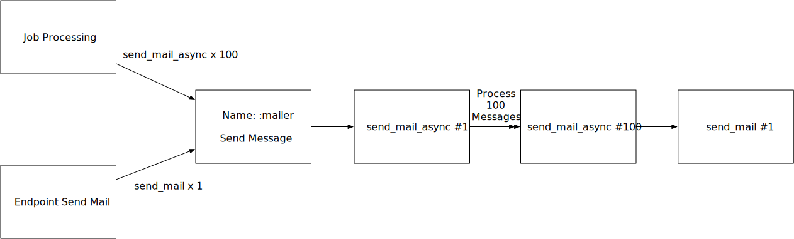
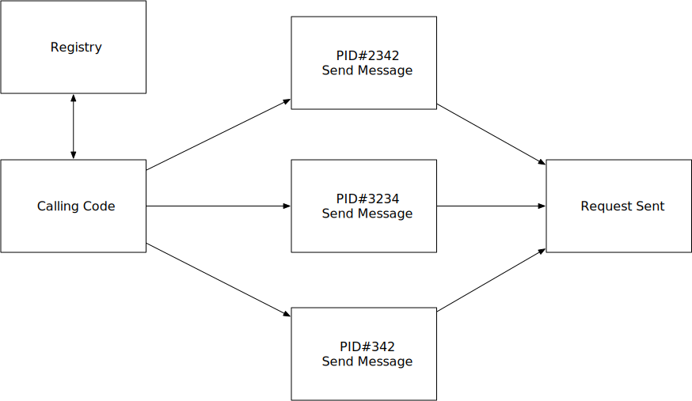

*This article assumes basic familiarity with [GenServers](https://elixirschool.com/en/lessons/advanced/otp-concurrency/#genserver)*

### Common GenServer Mistakes

Overusing GenServers is a common mistake when getting started with Elixir. The common pattern
I've seen is wrapping most of the code with a potential for failure in
a GenServer, because if it does fail, it is then isolated and won't crash the rest of the application.
However, GenServers have the potential to be extremely dangerous to our application
because they can become a bottleneck, which could even result in dropped messages from other processes.

One of GenServer’s most important principles is that it can only process one message at a time.
This means that in order to handle multiple messages happening in parallel, we need to have
multiple instances/processes of that GenServer running.


Elixir's concurrency and parallelism is achieved through processes.

<div style='display: flex; justify-content: center; align-items: center; margin: 20px 0;'>

</div>

### What are the costs of GenServers?
Let's say we're creating a mailer (using [Swoosh](https://github.com/swoosh/swoosh))
and you wrap our code in a GenServer (to stop it from crashing the application if it fails).
In this example we will see actual code I've seen in a production app.

```elixir
defmodule MyApp.Mailer do
  use Swoosh.Mailer, otp_app: :sample
end

defmodule MyApp.MailSender do
  use GenServer

  import Swoosh.Email

  @from_info {"Bill Nye", "BillNye@TheScienceGuy.org"}

  # Client

  def start_link(_), do: :ok

  def send_mail(email, name, subject, body) do
    GenServer.call(:mailer, {:send_email, {email, name, subject, body}})
  end

  def send_mail_async(email, name, subject, body) do
    GenServer.cast(:mailer, {:send_email, {email, name, subject, body}})
  end

  # Server (callbacks)

  @impl GenServer
  def init(_), do: :ok

  @impl GenServer
  def handle_cast({:send_mail, {email, name, subect, body}}, _, _) do
    email
      |> create_mail(name, subject, body)
      |> Mailer.deliver
  end

  @impl GenServer
  def handle_call({:send_mail, {email, name, subect, body}}, _, _) do
    email
      |> create_mail(name, subject, body)
      |> Mailer.deliver
  end

  defp create_mail(email, name, subject, body) do
    new()
      |> to({name, email})
      |> from(@from_info)
      |> subject(subject)
      |> html_body(body)
  end
end
```

Here we've created a GenServer with two functions that send mail. The `send_mail` function uses `call`, which
returns the results of the send request, while the `send_mail_async` function uses `cast`, which will return right
away and execute the request shortly after. This module allows mail sends to fail such, that the rest of
our system does not crash.

### Unintended Side Effects

By wrapping our code in a GenServer, a potential unintended side-effect
is that we are limited to being able to only process only one message at a time.
Our calls for the GenServer are run on a singular thread, meaning that calling
GenServer multiple times will result in a queue of messages, which could
potentially halt the calling process until the GenServer has finished
processing the prior queue to your message. This creates a bottleneck.

While this arrangement can be leveraged as a back-pressure system, there are much better solutions out
there, like [GenStage](https://hexdocs.pm/gen_stage/GenStage.html). One of the reasons for this is
timeouts. By default GenServers have a timeout of 5 seconds, after which your message will be dropped.
This timeout can be changed to any number you would like as  well as `:infinity`. However, when `:infinity` is used there's a
potential to overflow the mailbox with messages and crash the whole VM by running it out of memory.

##### Example:
Say we've got a job processing system, and it batches up groups of 100 emails and sends them all at once. In another part of our API,
we've got an endpoint that sends mail instantly, with the response of the mail passed along to the return of the API.

<div style='display: flex; justify-content: center; align-items: center; margin: 20px 0;'>

</div>

We're now waiting for `send_mail_async` #1 - 100 to run before that endpoint can return the result of sending its one message. In the worst case scenario, 100 messages clog the queue for too long and our API call to send a message times out.

### What is the harm
First, usually we don't want to be losing messages in the queue (as can happen with timeouts). Second, if we're running many long running functions at once, we want them returning as quickly as possible instead of one after the other, or our application won't be able to scale to demand.

GenServers have the capability of storing large amounts of state data. But we need to be careful about what we store in the state
because memory is not unlimited or cheap. And when it comes to message passing, large messages need to be passed in a different way from small ones, otherwise they will get copied in memory.
Making multiple copies of large messages can take up more system resources
than expected. Discord created [fastglobal](https://github.com/discordapp/fastglobal) as
a solution to this problem. Another potential solution is converting the message to binary first, as binaries larger than 64 bytes are stored in a shared area, and only the reference is passed between processes instead of the large binary data.

### Parallelism: Registries to the Rescue
If we want to solve some of these issues, particularly around creating bottlenecks or
slowdowns, we have the solution: registries! These provide us with a way to store a
key-value dictionary of name -> PID. This allows us to ask the registry to lookup
the PID and then call the PID directly which can be your GenServer.

Using registries changes the flow to something like this:

<div style='display: flex; justify-content: center; align-items: center; margin: 20px 0;'>

</div>

Registries provide a great solution to possible bottlenecks with GenServers that come from
many messages hitting at once. But this solution assumes we're running on one machine
locally, so what happens when we start to go distributed? This requires a registry that
can communicate distributedly, making these libraries some of the possible solutions:

- [horde](https://github.com/michalmuskala/horde)
- [gproc](https://github.com/uwiger/gproc)
- [pg2](http://erlang.org/doc/man/pg2.html)

### GenServers as Caches
On several occasions, I have seen GenServers being used as caches. Most recently, in a job interview
I was asked to create a caching module, so I went ahead and used [con_cache](https://github.com/sasa1977/con_cache).
I was told my solution differed from the norm and that most people had chosen to use a GenServer, which might not have been necessary. I see a lot of GenServers that could be implemented as [Agents](https://hexdocs.pm/elixir/Agent.html) instead.
It is better to use the simplest solution, adding complexity if necessary afterwards.

[con_cache](https://github.com/sasa1977/con_cache) runs on top of ETS, which for reads and writes can be async and can be
called in parallel. This means that we can't have a queue build up to access and modify the state when
there are tons of requests at once, which is a low but non-zero possibility with the GenServer implementation.
This limitation is something to be aware of and we should monitor and analyze performance
to see if we should use something like ETS instead, which,
incidentally, is also how registries work. If you are using ETS, I suggest using it behind
[con_cache](https://github.com/sasa1977/con_cache), which abstracts some of the hard parts.

### Summary
In this article we learned some of the dangers of GenServer, and how using them incorrectly can
lead to bottlenecks in your application. We also learned that using GenServers for long running
functions requires more thought, especially if the same GenServer has both `cast` and `call` as you can
lag the` cast`er due to prior `call`s . Finally we learned to use ETS or Agents instead of GenServers
for storing states if at all possible.

In an upcoming blog post about distributed GenServers we'll discuss how to use the different tools mentioned
to create a distributed registry. We’ll also discuss some of the pains, issues and questions we must ask ourselves around
GenServers at a distributed level.

Have you experienced a GenServer bottleneck? Have more questions about GenServers?


Let me know in the comments!
